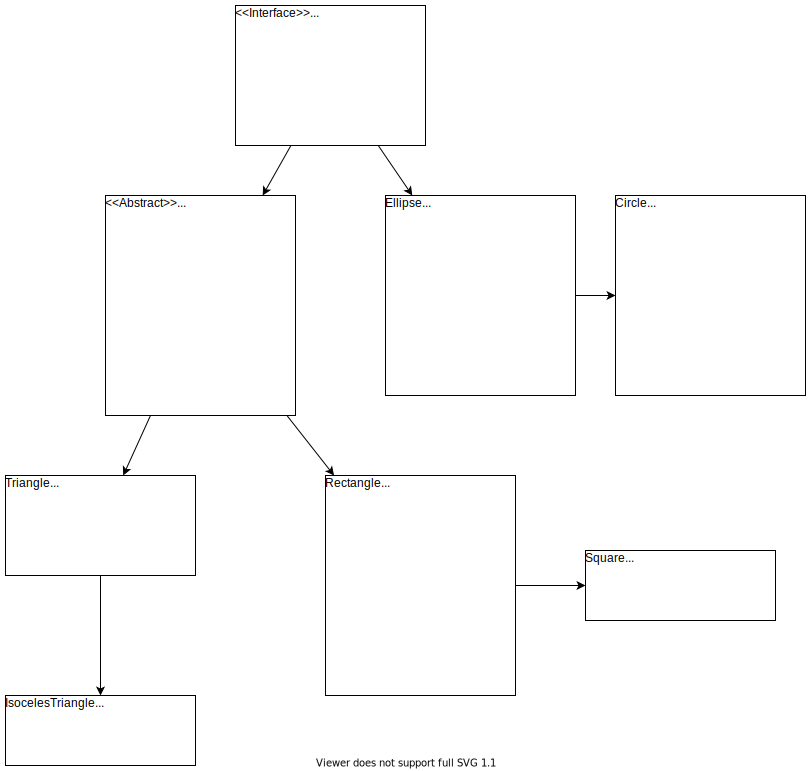

# Interfaces and Inheritance

This project demonstrates some interface and inheritance capabilities of Java.

The implementation revolves around shapes such as polygons and circles.

## UML

## Brief description

### Interface
Shape is the base interface which all other classes implement.
### Polygons
Polygon serves as the base abtract class for shapes with sides, and implements Shape.
A reference `setPerimeter()` is provided, since we expect all Polygons to calculate perimeter in a similar way.

This is done, since polygons with different sides may have different area formulas.

An override of `getArea()` is also performed in Rectangle to show what happens if a subclass is referenced by a superclass.

### Round shapes
Circles are special cases of Ellipses, and thus created as a child class of Ellipse.

### Polymorphism
Some simple examples of polymorphism is shown in App.java.

## Learning points
On `super()` call in the contructor, the child class' methods are not created/do not exist yet.

As a result, if there are methods which are implemented on parent and that need to be called during initialization, these methods should be in the child constructor after the `super()` call. 

Eg: Rectangles and Triangles call `this.setArea()` after `super()`, instead of calling `this.setArea()` in Polygon's constructor.