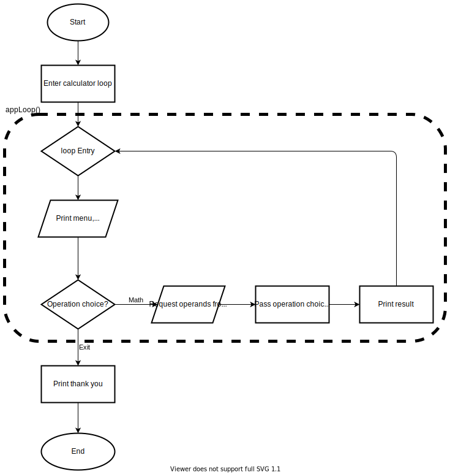

# Simple Calculator App
## Overview
2 classes:
- App.java to handle I/O and parsing and as main container class
- SimpleCalculator.java for math logic, simple static methods, no persistence built in

### Flowchart

### UML

test.java is the entry point to test this app.
